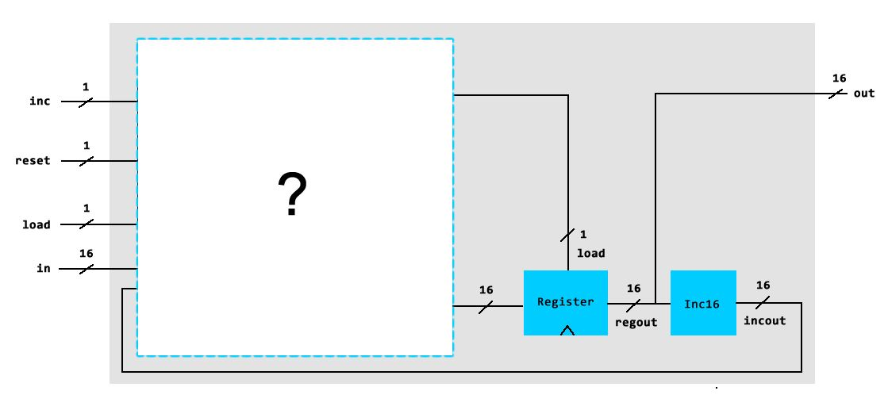
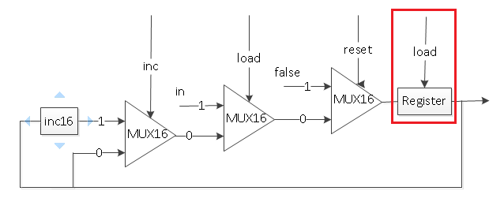

# Project 3 Sequential Chips

Project link on nand2tetris official website: https://www.nand2tetris.org/project03.

## Objective
> Build all the chips described in Chapter 3, leading up to a Random Access Memory (RAM) unit. The only building blocks that you can use are primitive DFF gates, chips that you will build on top of them, and chips described in previous chapters.

## Thoughts:
0. DFF
    * Primitive

1. [Bit](files/a/Bit.hdl)
    * Implement for two chips in the diagram, not considering uninitialized variables.
    * > The reason that the chip still works is that HDL is a hardware description language (also known as a "declarative" language). It describes the wiring connections that are needed to make the chip, not how it operates once power is applied. It makes no difference what order the parts are put into a circuit board. As long as all the parts get placed and connected together correctly, the circuit board will function. The Hardware Simulator "applies the power" and tests how the chip functions. An important aspect of this is that there is no such thing as an "uninitialized variable" in HDL. If a wire is connected to an output somewhere in the HDL, it can be connected to any input. This is particularly important to understand for Chapter 3. (http://nand2tetris.org/software/HDL%20Survival%20Guide.html)

2. [Register](files/a/Register.hdl)
    * Just use Bit for each bit in the array.

3. [RAM8](files/a/RAM8.hdl)
    * Need to have 8 registers updated correctly before outputting the selected register value -> DMux8Way to pass *load* to the selected register (others get 0, so won't change value)

4-7. [RAM64](files/a/RAM64.hdl), [RAM512](files/b/RAM512.hdl), [RAM4K](files/b/RAM4K.hdl), [RAM16K](files/b/RAM16K.hdl)
    * Same idea as RAM8.

8. [PC](files/a/PC.hdl)
    * 4 conditions -> 3 Mux16;  priority (highest to lowest): reset, load, inc.
    * Alternatively, 3 control bits -> Mux8Way16
    > The hardware tradeoff between using 3 Mux16 in series versus 1 Mux8Way16 is a typical space vs. speed choice. The maximum frequency for the counter will depend on how fast the feedback circuit is. The serial Mux16s will take about 3 times as long as the Mux8Way16, but the Mux8Way16 will be about 2 times the size, depending on the IC technology used. 
    (By cadet1620, extracted from http://nand2tetris-questions-and-answers-forum.32033.n3.nabble.com/PC-Hdl-td4026543.html)

    * Then feed the processed value into Register. Setting load=true turns Register into a DFF16.
    * (!) Note that PC should output from the Register. 
    > Outputting from other chips does not guarantee immediate storage and input after an output is made: the input may be made at the same time of storage, which would mess up the clock cycle. The output and storage of output must occur at the same time.
    (By Aditya Gomatam, extracted from https://www.coursera.org/learn/build-a-computer/discussions/weeks/3/threads/Di7gv-qREeeelw5rF-0c1g)
    * Diagram drawn by Bjorn Inge Westerheim (see https://www.coursera.org/learn/build-a-computer/discussions/all/threads/UVIv7X38EeaEYRLxIcdkdQ/replies/LDEa8n6DEea3IA7ABe4oxQ).
    
    * Diagram drawn by Desmond.Song (see http://nand2tetris-questions-and-answers-forum.32033.n3.nabble.com/PC-Hdl-td4026543.html)
    

